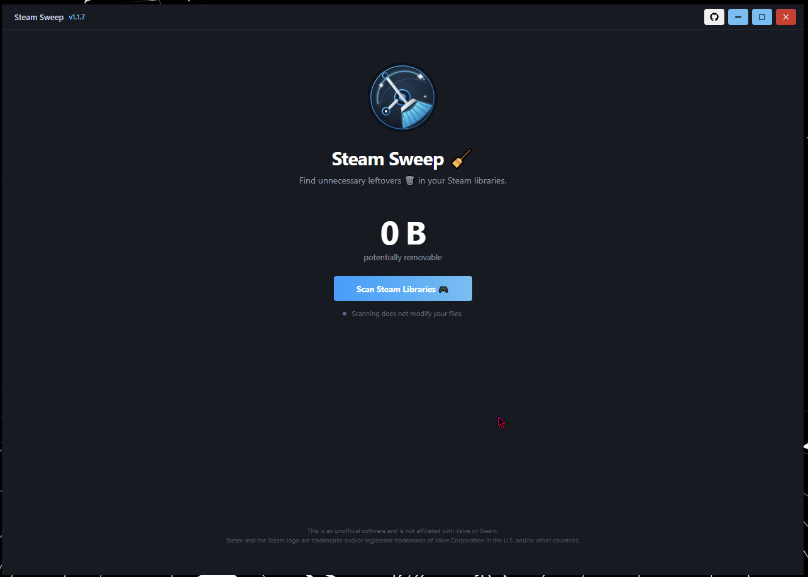

# Steam Sweep 🧹

	

- A lightweight Windows desktop utility for finding unnecessary leftover files in your Steam game libraries. 🎮
- Steam Sweep scans installed Steam games for files and folders that may no longer be needed, helping you identify clutter and reclaim disk space. 💾

> ⚠️ **Steam Sweep is unofficial software and is not affiliated with Valve Corporation or Steam.**

## ✨ Features

- Automatically scan your Steam games and find unnecessary leftovers
- Discover installed games across all your Steam libraries and drives
- Select exactly what you want to remove, individual files or an entire batch
- See exactly how much disk space you can reclaim before cleaning

### 🧹 Cleanup Detection

| Type | What SteamSweep Finds |
|---|---|
| 📁 Temporary Folders | Common temporary directories such as `tmp`, `temp`, `temporary`, `deriveddatacache`, and incomplete download folders |
| 📄 Temporary Files | Temporary files such as `.tmp`, `.temp`, and `.crdownload` |
| 📝 Log Files | Log files such as `.log`, `.txt_log`, `.trace`, and `.etl`, plus common log directories |
| 💥 Crash Dumps | Crash dumps and error reports such as `.dmp`, `.mdmp`, `.hdmp`, and `.wer`, plus common crash-report directories |
| 💾 Backup Files | Backup files such as `.bak`, `.old`, `.orig`, `.backup`, `.sav.bak`, and temporary `~` copies |
| 📦 Installers | Standalone installer executables such as `setup.exe`, `installer.exe`, `install.exe`, `dxsetup.exe`, and similar setup programs |
| 🧰 Installer Archives | Common DirectX, Visual C++, .NET, PhysX, XNA, OpenAL, EA, Epic Games, Ubisoft, and other redistributable installers or archives |
| 🗑️ Empty Folders | Folders containing no files or subfolders |

## 🔒 Safety

- Steam Sweep is designed to inspect Steam files before performing cleanup.
- The scanner itself is **read-only** and does not modify files while scanning.
- Cleanup actions should only be performed on files identified by Steam Sweep as cleanup candidates.

## 📜 License

This project is currently not licensed for redistribution.
Steam and the Steam logo are trademarks and/or registered trademarks of Valve Corporation in the U.S. and/or other countries.
